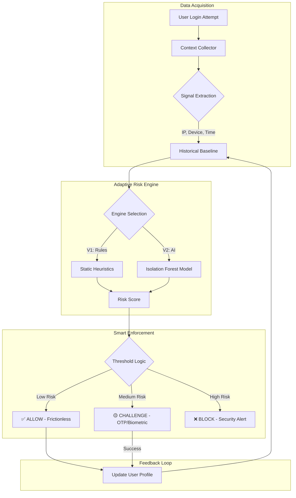

# 🔐 Adaptive Authentication System (Risk-based 2FA)

[](https://www.python.org/downloads/)
[](https://scikit-learn.org/stable/modules/generated/sklearn.ensemble.IsolationForest.html)
[](#)
[](#)

An intelligent, context-aware authentication framework that balances robust security with a frictionless user experience. This project demonstrates the evolution of authentication from static rules to dynamic AI-driven anomaly detection.

---

## 🏗️ Dual-Architecture Design

This repository features a side-by-side implementation of two distinct authentication paradigms, allowing for direct comparison of security efficacy and user friction.

| Feature | **Version 1 (Legacy Core)** | **Version 2 (Next-Gen AI)** |
| :--- | :--- | :--- |
| **Risk Engine** | Static Rule-Based (Heuristics) | AI-Powered (Isolation Forest) |
| **Verification** | 6-Digit Time-based OTP | Passwordless Biometric Push |
| **User Experience** | Moderate Friction (Manual entry) | Zero Friction (Tap-to-approve) |
| **Adaptability** | Manual updates required | Self-learning from behavior |

---

## ✨ Key Capabilities

### 🤖 AI-Driven Anomaly Detection (V2)
The heart of the system is an **Isolation Forest** machine learning model. Unlike traditional security systems that look for "known bad" patterns, our AI learns what "normal" behavior looks like for each user and identifies statistical outliers (anomalies) in real-time.
*   **Contextual Signals**: Analyzes IP Address, Device Fingerprint, and Login Time.
*   **Adaptive Learning**: Recognizes "Trusted" patterns (e.g., a user logging in from a new coffee shop they frequent) without manual intervention.

### 📱 Passwordless Biometrics (V2)
Replaces vulnerable and cumbersome OTPs with a simulated **FIDO2/WebAuthn** experience.
*   **Push Verification**: Users receive a simulated biometric prompt on their "trusted device".
*   **Cryptographic Binding**: Simulates the security of public-key cryptography where the private key never leaves the user's device.

### 🏢 Legacy Rule-Based Security (V1)
A robust implementation of traditional risk-based authentication.
*   **Scoring Heuristics**: Assigns risk scores based on IP changes (+40), new devices (+40), and unusual hours (+20).
*   **Trust Maturation**: Devices graduate to "Trusted" status after 3 successful OTP verifications.

### 📊 Real-Time Analytics Dashboard
Dual Streamlit dashboards provide deep visibility into the system's decision-making process:
*   **Live Event Stream**: Watch login attempts and security actions in real-time.
*   **Risk Heatmaps**: Visualize how the AI perceives different login scenarios.
*   **V1 vs V2 Comparison**: Directly compare how rules vs. AI handle the same attack scenario.

---

## 🗺️ System Architecture



---

## 🚀 Getting Started

### Prerequisites
*   Python 3.8 or higher
*   Pip package manager

### Installation
1. Clone the repository:
   ```bash
   git clone https://github.com/your-repo/2FA_authenticator.git
   cd 2FA_authenticator
   ```

2. Install dependencies:
   ```bash
   pip install pandas rich streamlit scikit-learn
   ```

3. (Optional) Initialize/Reset the data:
   ```bash
   python reset_csv.py
   ```

---

## 🎮 Running the Demo

For the best experience, we recommend running the system in a split-terminal environment.

### 🟢 Version 1: Rule-Based OTP
```bash
# Terminal 1: User Console
python system_console.py

# Terminal 2: Admin Dashboard
streamlit run dashboard.py
```

### 🟣 Version 2: ML + Passwordless
```bash
# Terminal 1: User Console
python system_console_v2.py

# Terminal 2: Comparison Dashboard
streamlit run dashboard_v2.py
```

---

## 📂 Project Structure

```text
2FA_Authenticator/
├── data/                       # Behavioral memory (CSV-based)
│   ├── login_history.csv       # Unified history for both engines
│   ├── data_events.csv         # Post-authentication activity
│   └── session_store.csv       # Active session management
│
├── src/
│   ├── stage4_risk_engine/     # The "Brains"
│   │   ├── risk_engine.py      # Rule-based logic (V1)
│   │   └── ml_engine.py        # Isolation Forest implementation (V2)
│   ├── stage5_otp/             # Verification Services
│   │   ├── otp_service.py      # 6-digit TOTP simulation
│   │   └── biometric_service.py# Passwordless push notification simulator
│   └── v2/                     # Modern Flow Orchestration
│       └── login_flow_v2.py    # AI-first authentication pipeline
│
├── system_console_v2.py        # Main entry point (V2)
└── dashboard_v2.py             # Streamlit analytics (V2)
```

---

## 🎭 Simulation Scenarios

When using the consoles, you can trigger specific behavioral patterns to test the engines:

1.  **Usual Activity**: Login from a known IP and device during normal hours.
2.  **Minor Anomaly**: Logging in from a new device (Triggers OTP/Biometric).
3.  **Traveling (Coffee Shop)**: New IP but same device (V2 AI may grant access while V1 Rules will challenge).
4.  **Credential Stuffing Attack**: Rapid logins from unknown locations at 3 AM (Triggers immediate BLOCK).

---

## 📝 License
This project is licensed under the MIT License - see the LICENSE file for details. Created for educational purposes to demonstrate modern cybersecurity patterns.
